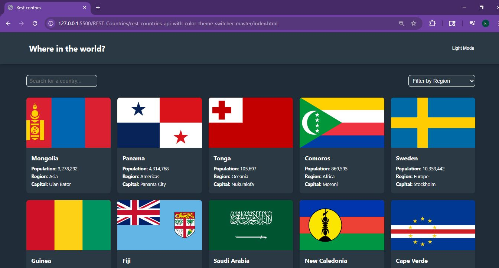

# Frontend Mentor - REST Countries API with color theme switcher solution

This is my solution to the [REST Countries API with color theme switcher challenge on Frontend Mentor](https://www.frontendmentor.io/challenges/rest-countries-api-with-color-theme-switcher-5cacc469fec04111f7b848ca). The challenge helped me improve my JavaScript and API integration skills by building a realistic app.

## Table of contents

- [Overview](#overview)
  - [The challenge](#the-challenge)
  - [Screenshot](#screenshot)
  - [Links](#links)
- [My process](#my-process)
  - [Built with](#built-with)
  - [What I learned](#what-i-learned)
  - [Continued development](#continued-development)
  - [Useful resources](#useful-resources)
- [Author](#author)

## Overview

### The challenge

Users should be able to:

- See all countries from the API on the homepage
- Search for a country using an input field
- Filter countries by region
- Click on a country to see more detailed information
- Click through to the border countries
- Toggle between light and dark mode

### Screenshot



### Links

- Solution URL: https://github.com/khadijaAmzoug/REST-Countries
- Live Site URL: https://timely-taiyaki-c4446d.netlify.app/

## My process

### Built with

- Semantic HTML5
- CSS3 (Flexbox + Grid)
- JavaScript (DOM, fetch API)
- REST Countries API
- Mobile-first approach
- Light/Dark mode switch

### What I learned

While building this project, I learned how to:

- Fetch and display data from an external API
- Dynamically update the DOM based on user input
- Use event delegation and manage navigation between pages
- Implement a dark/light theme using JavaScript

```js
// Example of dynamic fetch
fetch('https://restcountries.com/v3.1/all')
  .then(res => res.json())
  .then(data => displayCountries(data));

## Continued development
In the future, I want to:

Improve accessibility (keyboard navigation, ARIA)

Add loading animations and error messages

Optimize for performance and SEO

Useful resources
MDN Web Docs - For everything JavaScript and CSS.

REST Countries API Docs - The main API used in the project.

Frontend Mentor Community - For helpful discussions and inspiration.

Author
GitHub - @khadija-amzoug

Frontend Mentor - @khadija-amzoug

